# Taller 3

## Creo la rama primera y me cambio a ella  
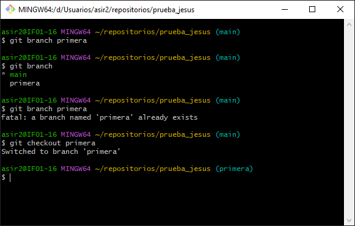
## Creo un fichero en la rama primera 
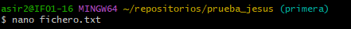
## Modifico el fichero y hago commit a los cambios

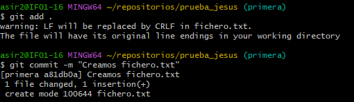
## Cambio a la rama main y la fusiono con la primera
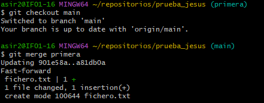
## Borro la rama primera
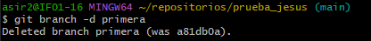
## Creo la rama segunda y un fichero en la rama main 
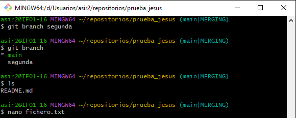 
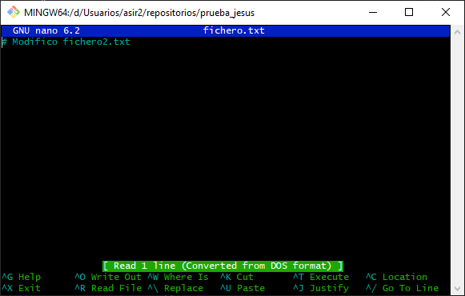
## Guardo los cambios con commit
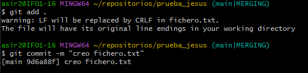
## Cambio a la rama segunda y creo un fichero
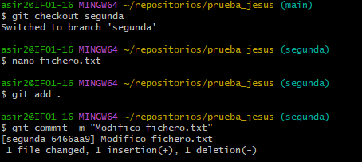 
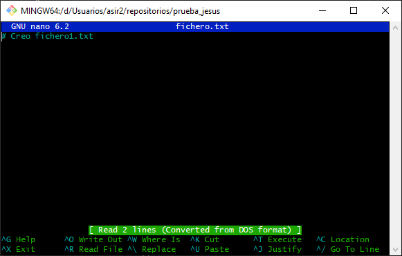
## Cambio a la rama main y modifico el fichero 
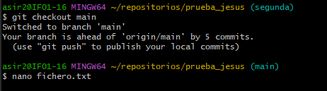
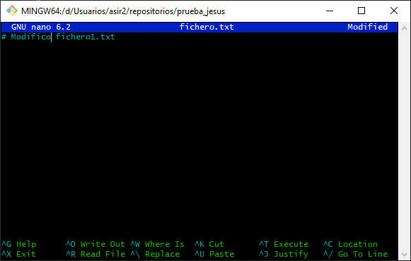
## Fusiono la rama main con segunda pero da conflicto y modifico el fichero para solucionar el conflicto 
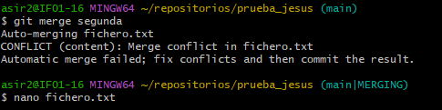
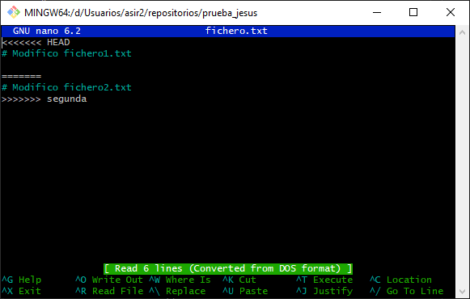
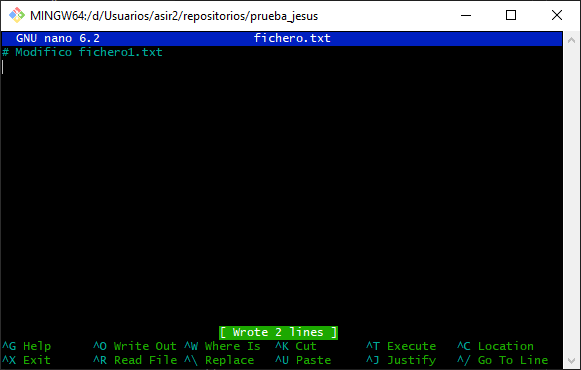
## Guardo los cambios y lo subo a remoto
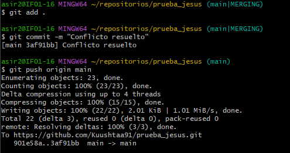

